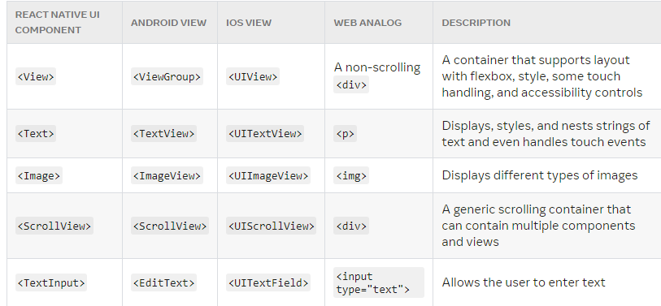

# REACT NATIVE CORE COMPONENTS!

1. # Create a new project with

    npx create-expo-app AwesomeProject

    # Files Created:

    - **Babel**: Compiles newer JS langauge down to older versions of JS.
      Js code should just work regardles of engine.

    - **app.json**
    Contains configuration settings for Expo app. App name, icon, splash screen etc.

    - **package.json**
    Metadata: Project name, version, description etc. This data is what others will see when accessing the package on npm.

    Dependencies and DevDependencies: Lists libraries, frameworks, tools etc.

    scripts: Shortcuts for running tasks like starting the dev. server, building project, running tests etc.

    main: Entry point of the app.

2. # How it works (App.js example)

    - *CREATES A COMPONENT*
    function CounterButton ({title, onIncrement}){
        return <Button title={title} onPress={onIncrement}/>
    }

    - *DISPLAY IT IN THE export defaulth function App*
    export default function App() {
    const [count, setCount] = useState(0)
    return(
        <View>
        ...
        <CounterButton title={`Click here to increment: ${count}`}
        onIncrement={() => setCount (count +1)} />
        ...
        </View>
    )}
    # This way, the component can be used many times with different titles defined in the export default

here now: 
https://www.reactnative.express/react/user_input
